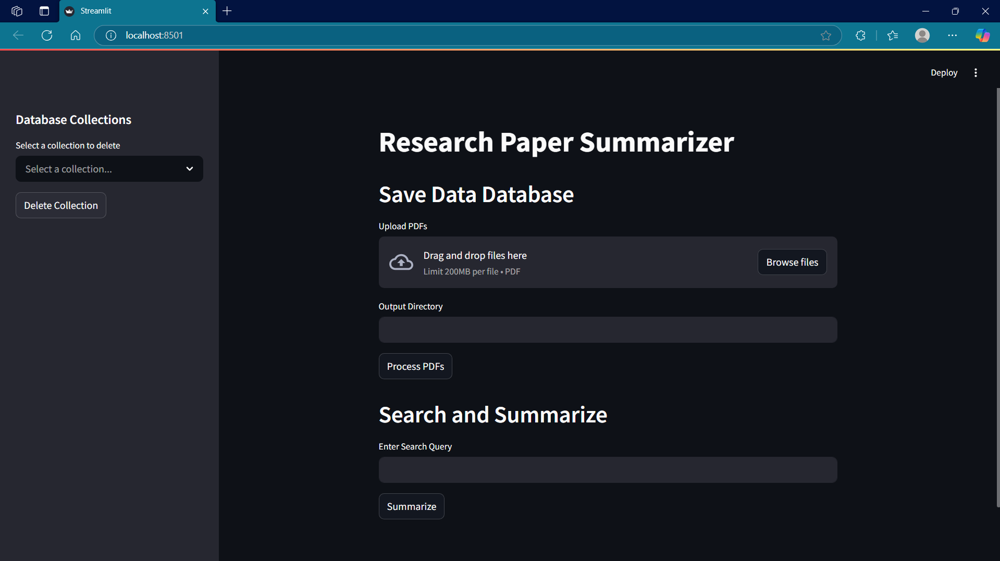
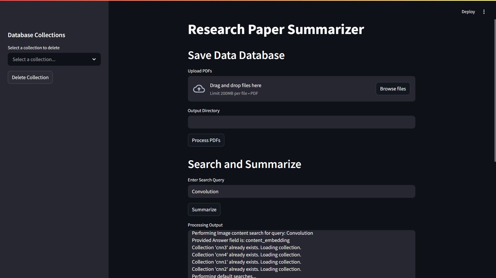
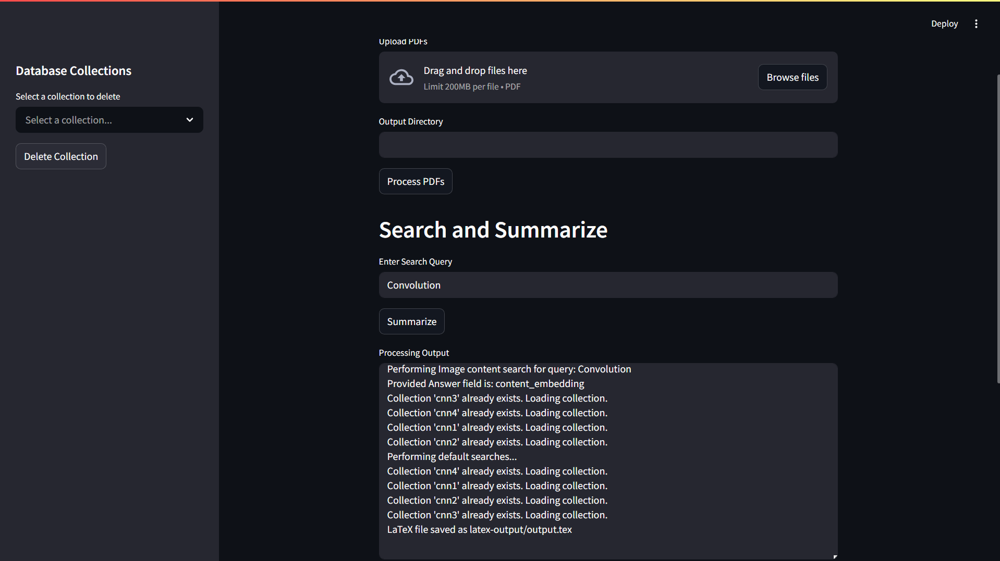

# 🧠 Research Paper Summarizer

Developed during an NVIDIA Internship, this project is an end-to-end platform that helps researchers quickly analyze and extract key insights from academic papers using semantic search, vector databases, LLM-powered summarization, and LaTeX PDF generation.

## 🔍 What It Does

- 📥 Upload PDFs of research papers via a user-friendly Streamlit interface.

- 🧠 Parse and embed the content using Llama Cloud API, Sentence Transformers, and convert to Markdown + JSON.

- 📚 Store embeddings in Milvus, a scalable vector database.

- 🔎 Perform Semantic Search based on user queries (content, abstract, images, etc.).

- 🧾 Generate Section-wise Summaries (Abstract, Introduction, Methodology, Results, Conclusion, References, and even Figure Captions).

- 📄 Output a LaTeX-based PDF — beautifully structured, citation-ready, and exportable.

## 🛠️ Technologies Used


| Tool/Library               | Purpose                        |
|-------------------------|------------------------------------------|
| Streamlit              | Web UI for uploading, searching |
| LlamaParse (Llama Cloud) | PDF parsing and Markdown generation                        |
| Pymilvus                    | 	Vector database storage/search                         |
| Sentence Transformers        | Embedding generation for search                          |
| Gemini API                | Summarization & captioning via LLMs                        |
| LaTeX (arxiv cls)                    | Academic formatting for output PDF          |

## 📦 Features

- 📂 Multi-PDF upload & processing.

- 📄 Markdown and JSON generation with structural hierarchy.

- 🖼️ Intelligent image extraction with auto-captioning.

- 🧠 Section-specific summarization (Abstract, Intro, Methods, etc.).

- 🧾 Formatted references in IEEE style.

- 🧑‍🔬 Literature review generation via citation understanding.

- 📊 Final output in a two-column LaTeX-formatted PDF (like IEEE/Arxiv style).

## 🔧 Setup & Installation

### Prerequisites

- **Python 3.8+** installed on your system
- **Docker Desktop** (for Windows/Mac) or **Docker Engine** (for Linux)
  - Windows: [Download Docker Desktop for Windows](https://docs.docker.com/desktop/install/windows-install/)
  - Mac: [Download Docker Desktop for Mac](https://docs.docker.com/desktop/install/mac-install/)
  - Linux: [Install Docker Engine](https://docs.docker.com/engine/install/)
- **Git** (to clone the repository)

### Step 1: Clone the Repository

```bash
git clone https://github.com/Vicky16032205/DocFusion.git
cd DocFusion
```

### Step 2: Start Milvus Vector Database Services

The project uses Milvus as a vector database, which requires running several services (etcd, MinIO, and Milvus) via Docker Compose.

#### On Windows (PowerShell or Command Prompt)

```bash
docker-compose up -d
```

#### On Linux/Mac (Terminal)

```bash
docker-compose up -d
```

**Note:** The `-d` flag runs the containers in detached mode (in the background).

#### Verify Services are Running

Check that all containers are running:

```bash
docker ps
```

You should see three containers running:
- `milvus-etcd` (port 2379)
- `milvus-minio` (port 9000)
- `milvus` (ports 19530, 19121)

### Step 3: Install Python Dependencies

#### On Windows (PowerShell or Command Prompt)

```bash
pip install -r requirements.txt
```

#### On Linux/Mac (Terminal)

```bash
pip install -r requirements.txt
```

**Tip:** It's recommended to use a virtual environment:

**Windows:**
```bash
python -m venv venv
venv\Scripts\activate
pip install -r requirements.txt
```

**Linux/Mac:**
```bash
python -m venv venv
source venv/bin/activate
pip install -r requirements.txt
```

### Step 4: Configure API Keys

You'll need to set up API keys for:
- **Llama Cloud API** (for PDF parsing)
- **Gemini API** (for summarization)

Set these as environment variables:

**Windows (PowerShell):**
```powershell
$env:LLAMA_CLOUD_API_KEY="your_llama_cloud_api_key"
$env:GEMINI_API_KEY="your_gemini_api_key"
```

**Windows (Command Prompt):**
```cmd
set LLAMA_CLOUD_API_KEY=your_llama_cloud_api_key
set GEMINI_API_KEY=your_gemini_api_key
```

**Linux/Mac:**
```bash
export LLAMA_CLOUD_API_KEY="your_llama_cloud_api_key"
export GEMINI_API_KEY="your_gemini_api_key"
```

### Step 5: Run the Application

Start the Streamlit application:

```bash
streamlit run app.py
```

The application will open in your default web browser at `http://localhost:8501`.

### Stopping the Services

When you're done, stop the Docker containers:

```bash
docker-compose down
```

To stop and remove all data volumes:

```bash
docker-compose down -v
```

### Troubleshooting

#### Windows-Specific Issues

**Issue: "docker-compose: command not found"**
- Solution: Make sure Docker Desktop is installed and running. Docker Compose comes bundled with Docker Desktop for Windows.

**Issue: "Cannot connect to the Docker daemon"**
- Solution: Ensure Docker Desktop is running. Check the system tray for the Docker icon.

**Issue: WSL 2 installation incomplete**
- Solution: Docker Desktop for Windows requires WSL 2. Follow the [WSL 2 installation guide](https://docs.microsoft.com/en-us/windows/wsl/install).

**Issue: Port conflicts (19530, 9000, 2379 already in use)**
- Solution: Stop any services using these ports or modify the port mappings in `docker-compose.yml`.

#### General Issues

**Issue: "Failed to connect to Milvus"**
- Solution: 
  1. Verify containers are running: `docker ps`
  2. Check container logs: `docker logs milvus`
  3. Restart services: `docker-compose restart`

**Issue: Out of memory errors**
- Solution: Increase Docker Desktop memory allocation in Settings > Resources > Advanced.

## 🚀 How It Works

1. 🔧 Upload and Process PDFs
   - PDFs are parsed and converted to Markdown + JSON.
   - Headings, subheadings, content, and images are extracted and embedded.

2. 💾 Store to Milvus
   - Data is vectorized and stored by topic/section-wise embeddings using Pymilvus.

3. 🔍 Semantic Search
   - Enter a query (e.g., "Convolution") to fetch top-matching excerpts.
   - Gemini API processes and summarizes the content per section.

4. 🧾 Generate PDF
   - Markdown output is converted to LaTeX using ToLatex.py.
   - A polished PDF is compiled with structure, images, and references.
  
## 📁 Project Structure
```
.ResearchPaperSummarizer
├── data/
│   └── (Contents of the data directory - e.g., sample_data.csv)
├── extracted/
│   └── (Contents of the extracted directory)
├── images/
│   └── (Contents of the images directory - e.g., logo.png)
├── latex-output/
│   └── (Generated LaTeX files)
├── output_directory/
│   └── (Output files from scripts)
├── README.md          (This file - provides an overview of the repository)
├── ToLatex.py         (Python script to convert to LaTeX)
├── app.py             (Main application file)
├── arxiv.sty          (LaTeX style file for arXiv)
├── automation.py      (Script for automated tasks)
├── lln_prompt.py      (Script related to large language model prompts)
├── paper.md           (Markdown source for the research paper)
├── parser.py          (Script for parsing data)
├── requirements.txt   (List of Python dependencies)
├── retrieval.py       (Script for information retrieval)
└── usegemini.py       (Script utilizing the Gemini model)
```

## 🧪 Example Use Case

- Upload 3 papers on CNN architectures.
- Type: Convolution techniques.
- Click Summarize.
- A PDF is generated with:
  - 💡 Custom Abstract
  - 📖 Introduction & Methodology
  - 🔍 Query-specific insights
  - 📊 Results & Discussion
  - 📎 Formatted references

## Screenshots






